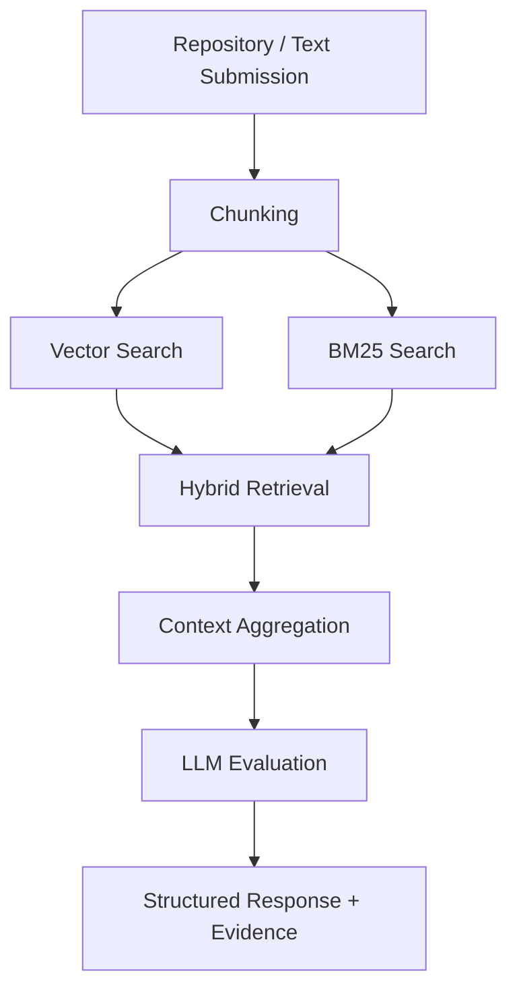

# AI Submission Analysis API

AI-powered система для автоматической оценки текстовых сабмитов и GitHub-репозиториев по пользовательским критериям.

Поддерживаются два сценария:

- анализ текста по полю `textContent`
- анализ GitHub-репозитория по полю `repo_url`

Оба endpoint'а возвращают единый JSON-формат с результатами оценки по критериям.

## Возможности

- автоматический разбор сабмитов по заданным критериям
- гибридный retrieval: семантический поиск + BM25
- поиск подтверждающих фрагментов в коде и тексте
- формирование краткого ответа и итоговой оценки
- выдача evidence с цитатами и ссылками на источники

## Architecture



## Установка

```bash
python3 -m venv .venv
source .venv/bin/activate
pip install -r requirements.txt
```

## Запуск API

Из корня проекта:

```bash
uvicorn src.api:app --host 0.0.0.0 --port 8000
```

Также можно запускать так:

```bash
python3 -m src.api
```

По умолчанию `python3 -m src.api` стартует на порту `8000`.

## Настройка порта

Через `uvicorn`:

```bash
uvicorn src.api:app --host 0.0.0.0 --port 9000
```

Через переменную окружения:

```bash
PORT=9000 python3 -m src.api
```

## Конфигурация

Пример конфигурации LLM API:

```python
config = RepoAnalysisConfig(
    api_base_url="https://api.mistral.ai/v1",
    api_key=os.getenv("API_KEY"),
    api_model_name="open-mistral-7b",
    max_new_tokens=1024,
)
```

## Endpoint'ы

### 1. Анализ текста

`POST /analyze/text`

Пример тела запроса:

```json
{
  "title": "Технические аспекты",
  "textContent": "text",
  "criteria": [
    {"id": "101", "description": "Какая модель и подход были использованы"},
    {"id": "102", "description": "Есть ли README в репозитории"},
    {"id": "103", "description": "Какие метрики качества указаны"},
    {"id": "104", "description": "Насколько подробно описан технический стек"}
  ]
}
```

Пример вызова:

```bash
curl -X POST http://localhost:8000/analyze/text \
  -H "Content-Type: application/json" \
  -d '{
    "title": "Технические аспекты",
    "textContent": "text",
    "criteria": [
      {"id": "101", "description": "Какая модель и подход были использованы"},
      {"id": "102", "description": "Есть ли README в репозитории"},
      {"id": "103", "description": "Какие метрики качества указаны"},
      {"id": "104", "description": "Насколько подробно описан технический стек"}
    ]
  }'
```

### 2. Анализ репозитория

`POST /analyze/repository`

Пример тела запроса:

```json
{
  "repo_url": "https://github.com/owner/repo",
  "criteria": [
    {"id": "101", "description": "Какая модель и подход были использованы"},
    {"id": "102", "description": "Есть ли README в репозитории"},
    {"id": "103", "description": "Какие метрики качества указаны"},
    {"id": "104", "description": "Насколько подробно описан технический стек"}
  ]
}
```

Пример вызова:

```bash
curl -X POST http://localhost:8000/analyze/repository \
  -H "Content-Type: application/json" \
  -d '{
    "repo_url": "https://github.com/owner/repo",
    "criteria": [
      {"id": "101", "description": "Какая модель и подход были использованы"},
      {"id": "102", "description": "Есть ли README в репозитории"},
      {"id": "103", "description": "Какие метрики качества указаны"},
      {"id": "104", "description": "Насколько подробно описан технический стек"}
    ]
  }'
```

## Формат ответа

Оба endpoint'а возвращают массив:

```json
[
  {
    "criterion_id": "101",
    "criterion_description": "Какая модель и подход был использован",
    "score": 8,
    "answer": "Краткий вывод",
    "evidence": [
      {
        "path": "README.md",
        "chunk_index": 0,
        "quote": "Фрагмент текста",
        "why": "Почему это подтверждает вывод"
      }
    ],
    "confidence": 0.87
  }
]
```

## Пример вывода
```json
{
  "criterion_id": "101",
  "criterion_description": "Какая модель и подход были использованы",
  "score": 7,
  "confidence": 0.95,
  "answer": "Основной подход включает использование LightGBM как финальной модели и LogisticRegression как базовой модели в процессе обучения. Также применяются SHAP-анализ для интерпретируемости, полиномиальные взаимодействия через PolynomialFeatures, логарифмические трансформации, классовая балансировка, байесовская импутация пропусков и агрегация признаков.",
  "evidence": [
    {
      "path": "README.md",
      "chunk_index": 0,
      "quote": "LightGBM | SHAP summary/dependence/force plots",
      "why": "README описывает использование LightGBM и SHAP для интерпретации модели"
    },
    {
      "path": "Notebooks/Training.ipynb",
      "chunk_index": 4,
      "quote": "В качестве базовой модели выберем LogisticRegression",
      "why": "Notebook подтверждает использование LogisticRegression как baseline-модели"
    },
    {
      "path": "models",
      "chunk_index": 0,
      "quote": "best_lgbm.joblib",
      "why": "Артефакт модели указывает на использование LightGBM"
    },
    {
      "path": "src/features.py",
      "chunk_index": 0,
      "quote": "PolynomialFeatures(degree=2, interaction_only=True, include_bias=False)",
      "why": "Подтверждает использование feature interactions"
    },
    {
      "path": "src/preprocessing.py",
      "chunk_index": 0,
      "quote": "MonthlyIncomeImputer('../models/bayesian_mi.joblib')",
      "why": "Используется байесовская импутация пропусков"
    },
    {
      "path": "src/preprocessing.py",
      "chunk_index": 0,
      "quote": "LogTransformer(cols=['DebtRatio', 'PastDueAggregated'])",
      "why": "Подтверждает использование логарифмических трансформаций"
    }
  ]
}
```

## Используемые технологии

* Python
* FastAPI
* LangChain / LangGraph
* ChromaDB
* BM25
* Transformers
* PyTorch
